<div align="center">

```
██╗  ███████╗ ██████╗ ██████╗  ██████╗ ███████╗
██║  ██╔════╝██╔═══██╗██╔══██╗██╔════╝ ██╔════╝
██║  █████╗  ██║   ██║██████╔╝██║  ███╗█████╗
██║  ██╔══╝  ██║   ██║██╔══██╗██║   ██║██╔══╝
██║  ██║     ╚██████╔╝██║  ██║╚██████╔╝███████╗
╚═╝  ╚═╝      ╚═════╝ ╚═╝  ╚═╝ ╚═════╝ ╚══════╝
```

### Claude Code, run as a disciplined engineering team.

[](#license)
[](#license)
[](#docs)
[](#the-sprint)
[](#the-sprint)

</div>

<br>

**Iforge turns Claude Code into a disciplined engineering team** — a CEO who
rethinks the product, an eng manager who locks architecture, a designer who
catches AI slop, a reviewer who finds production bugs, a QA lead who opens a
real browser, a security officer who runs OWASP + STRIDE audits, a release
engineer who ships the PR, and a delivery team that keeps clients in the
loop without anyone writing a status update by hand.

Iforge started from [GStack](https://github.com/garrytan/gstack), the open
source Claude Code skill framework built by Garry Tan. We use it every day
at Inspire Labs AI for both client work and our own products, and we built
five additional skills on top of it — `/proposal`, `/handoff`,
`/bug-triage`, `/brand-guard`, and `/scope-creep` — to cover the parts of
running client engagements that a single-product workflow never needed. See
[NOTICE](NOTICE) for the full attribution.

Every skill is a slash command. Every skill is Markdown. All of it is free,
MIT licensed.

**Who this is for:**
- **Studios and agencies** juggling multiple client engagements at once
- **Product teams** who want structured planning, review, and QA instead of ad-hoc prompting
- **First-time Claude Code users** — structured roles instead of a blank prompt
- **Tech leads and staff engineers** — rigorous review, QA, and release automation on every PR

<br>

## 📖 Contents

<table>
<tr>
<td valign="top" width="50%">

- [🚀 Quick start](#-quick-start)
- [⚙️ Install](#️-install)
- [👀 See it work](#-see-it-work)
- [🧭 The sprint](#-the-sprint) — full skill reference
- [🤝 Client & delivery skills](#-client--delivery-skills-added-by-inspire-labs-ai)

</td>
<td valign="top" width="50%">

- [🧹 Uninstall](#-uninstall)
- [🧠 GBrain](#-gbrain--persistent-knowledge-for-your-coding-agent)
- [📚 Docs](#-docs)
- [🔒 Privacy & Telemetry](#-privacy--telemetry)
- [🛠️ Troubleshooting](#️-troubleshooting)

</td>
</tr>
</table>

<br>

## 🚀 Quick start

1. Install Iforge (see below)
2. Run `/office-hours` — describe what you're building
3. Run `/proposal` if this is client work, to scope it before anything else
4. Run `/plan-ceo-review` on any feature idea
5. Run `/review` on any branch with changes
6. Run `/qa` on your staging URL
7. Run `/handoff` to draft the client-facing update
8. Stop there. You'll know if this is for you.

<br>

## ⚙️ Install

**Requirements:** [Claude Code](https://docs.anthropic.com/en/docs/claude-code), [Git](https://git-scm.com/), [Bun](https://bun.sh/) v1.0+, [Node.js](https://nodejs.org/) (Windows only)

> [!WARNING]
> **Windows users, read this before you start:** the installer is a shell script.
> It runs correctly two ways — through **Claude Code** (Method A) on any OS, or
> typed directly into **Git Bash / WSL** (Method B). It will **not** run in
> Command Prompt or plain PowerShell — those can't execute shell scripts, and
> `./setup` will fail with `'.' is not recognized as an internal or external
> command`. If you hit that error, you're in the wrong shell — see Method B.

### Method A — let Claude Code install it (works on any OS, no terminal needed)

1. Open Claude Code.
2. Paste the message below exactly as-is. Claude runs the install and configures itself.

> Install Iforge: run **`git clone --single-branch --depth 1 https://github.com/Inspire-Labs-AI/iforge.git ~/.claude/skills/gstack && cd ~/.claude/skills/gstack && ./setup`** then add a "gstack" section to CLAUDE.md that says to use the /browse skill from gstack for all web browsing, never use mcp\_\_claude-in-chrome\_\_\* tools, and lists the available skills: /office-hours, /proposal, /plan-ceo-review, /plan-eng-review, /plan-design-review, /design-consultation, /design-shotgun, /design-html, /review, /ship, /land-and-deploy, /canary, /benchmark, /browse, /connect-chrome, /qa, /qa-only, /design-review, /setup-browser-cookies, /setup-deploy, /setup-gbrain, /retro, /investigate, /document-release, /document-generate, /codex, /cso, /autoplan, /plan-devex-review, /devex-review, /careful, /freeze, /guard, /unfreeze, /gstack-upgrade, /learn, /handoff, /bug-triage, /brand-guard, /scope-creep. Then ask the user if they also want to add it to the current project so teammates get it.

3. Once it finishes, type `/` in Claude Code and confirm the skills show up in the dropdown.

### Method B — install it yourself from a terminal

Only works in **Git Bash** or **WSL**. On Windows, do not use Command Prompt or plain PowerShell — see the warning above.

1. Open Git Bash (Windows: search "Git Bash" in the Start menu, or right-click any folder in File Explorer → "Git Bash Here") or your regular terminal on macOS/Linux/WSL.
2. Run these three commands:
   ```bash
   git clone --single-branch --depth 1 https://github.com/Inspire-Labs-AI/iforge.git ~/.claude/skills/gstack
   cd ~/.claude/skills/gstack
   ./setup
   ```
3. Open Claude Code, type `/`, and confirm the skills show up in the dropdown.

> [!TIP]
> **If you already tried this in Command Prompt or PowerShell and it failed:** it likely created a stray folder literally named `~` instead of using your real home folder. Clean it up first, then retry in Git Bash:
> ```bash
> rm -rf ~/.claude/skills/gstack ~/'~'
> ```

> [!NOTE]
> **Why the installed folder is named `gstack`, not `iforge`:** the repo is `iforge`, but every skill's internal scripts have `~/.claude/skills/gstack` hardwired into them. Both names are correct — this is expected, not a bug.

<br>

<details>
<summary><strong>📂 What actually gets created — read this before you go looking around</strong></summary>

<br>

Installing creates **two different things**. This is normal, not a bug — but
it confuses people who go poking around the folders afterward, so know it
upfront:

1. **`~/.claude/skills/gstack/`** — the full source: the browser engine,
   build scripts, and every skill's original files, all nested inside this
   one folder. Claude Code does **not** read skills from here directly.
2. **`~/.claude/skills/<skill-name>/`** — one flat folder per skill, sitting
   *next to* `gstack/`, not inside it — e.g. `~/.claude/skills/proposal/`,
   `~/.claude/skills/office-hours/`. `./setup` creates these automatically.
   **This is what Claude Code actually scans** for the `/` dropdown.

So after a successful install, your `~/.claude/skills/` folder looks like this:

```
~/.claude/skills/
├── gstack/              ← full source, don't touch its contents directly
│   ├── proposal/        ← the original copy lives here too
│   ├── office-hours/
│   └── ... (bin/, browse/, scripts/, and everything else)
├── proposal/             ← Claude Code reads THIS one
├── office-hours/         ← and THIS one
└── ... (one flat folder per skill)
```

> [!CAUTION]
> **Never manually move, cut, copy, or delete anything inside `gstack/`.**
> `./setup` creates and refreshes every flat folder above automatically, every
> time it runs — there is no manual step here. Moving files out of `gstack/`
> by hand removes them from the source repo (a "move" deletes the original),
> which corrupts the install and causes exactly the kind of build errors
> covered in [Troubleshooting](#️-troubleshooting). If a skill isn't showing up,
> the fix is always to re-run `./setup`, never to move files yourself.

</details>

<br>

### Team mode — auto-update for shared repos (recommended)

From inside your repo, paste this. Switches you to team mode, bootstraps the repo so teammates get it automatically, and commits the change:

```bash
(cd ~/.claude/skills/gstack && ./setup --team) && ~/.claude/skills/gstack/bin/gstack-team-init required && git add .claude/ CLAUDE.md && git commit -m "require Iforge for AI-assisted work"
```

No vendored files in your repo, no version drift, no manual upgrades. Every Claude Code session starts with a fast auto-update check (throttled to once/hour, network-failure-safe, completely silent).

Swap `required` for `optional` if you'd rather nudge teammates than block them.

### Other AI Agents

Iforge inherits GStack's multi-agent support — setup auto-detects which agents you have installed:

```bash
git clone --single-branch --depth 1 https://github.com/Inspire-Labs-AI/iforge.git ~/gstack
cd ~/gstack && ./setup
```

Or target a specific agent with `./setup --host <name>`:

| Agent | Flag | Skills install to |
|-------|------|-------------------|
| OpenAI Codex CLI | `--host codex` | `~/.codex/skills/gstack-*/` |
| OpenCode | `--host opencode` | `~/.config/opencode/skills/gstack-*/` |
| Cursor | `--host cursor` | `~/.cursor/skills/gstack-*/` |
| Factory Droid | `--host factory` | `~/.factory/skills/gstack-*/` |
| Slate | `--host slate` | `~/.slate/skills/gstack-*/` |
| Kiro | `--host kiro` | `~/.kiro/skills/gstack-*/` |
| Hermes | `--host hermes` | `~/.hermes/skills/gstack-*/` |
| GBrain (mod) | `--host gbrain` | `~/.gbrain/skills/gstack-*/` |

<br>

## 👀 See it work

```text
You:    We need a loyalty rewards page for a client's e-commerce site.
You:    /proposal
Claude: [drafts deliverables, an explicit out-of-scope list, timeline,
        assumptions, and open questions for the client]

You:    Client approved it. Let's build.
You:    /office-hours
Claude: [asks about the pain — specific examples, not hypotheticals]
        [writes design doc → feeds into downstream skills automatically]

You:    /plan-eng-review
        [ASCII diagrams for data flow, state machines, error paths]
        [test matrix, failure modes, security concerns]

You:    Approve plan. Exit plan mode.
        [writes the feature. code follows the plan, not assumptions.]

You:    /review
        [AUTO-FIXED] 2 issues. [ASK] Race condition → you approve fix.

You:    /qa https://staging.myapp.com
        [opens real browser, clicks through flows, finds and fixes a bug]

You:    /ship
        Tests: 42 → 51 (+9 new). PR: github.com/you/app/pull/42

You:    /handoff
Claude: "This week we shipped the loyalty rewards page. Users now earn
        points on purchases and redeem them for discount codes. Live now,
        nothing needed from you."

You:    [two weeks later] Client asks for a referral bonus feature.
You:    /scope-creep
Claude: Out of scope — flagged as a future addition in the original
        proposal. Suggested response: quote separately or defer to phase 2.
```

Client work goes in scoped, tracked, and communicated — not absorbed silently until the margin disappears.

<br>

## 🧭 The sprint

Iforge is a process, not a collection of tools. The skills run in the order a sprint runs:

**Scope → Think → Plan → Build → Review → Test → Ship → Communicate → Reflect**

```mermaid
flowchart LR
    A["🎯 Scope<br/><code>/proposal</code>"] --> B["🧠 Think<br/><code>/office-hours</code>"]
    B --> C["📐 Plan<br/><code>/plan-ceo-review</code><br/><code>/plan-eng-review</code><br/><code>/plan-design-review</code>"]
    C --> D["🔨 Build"]
    D --> E["🔍 Review<br/><code>/review</code>"]
    E --> F["🧪 Test<br/><code>/qa</code>"]
    F --> G["🚀 Ship<br/><code>/ship</code>"]
    G --> H["📣 Communicate<br/><code>/handoff</code>"]
    H --> I["♻️ Reflect<br/><code>/retro</code>"]
    I -.->|"next ask?"| J["🚧 Scope-creep check<br/><code>/scope-creep</code>"]
    J -.-> A

    style A fill:#2b2d42,stroke:#8d99ae,color:#fff
    style B fill:#2b2d42,stroke:#8d99ae,color:#fff
    style C fill:#2b2d42,stroke:#8d99ae,color:#fff
    style D fill:#2b2d42,stroke:#8d99ae,color:#fff
    style E fill:#2b2d42,stroke:#8d99ae,color:#fff
    style F fill:#2b2d42,stroke:#8d99ae,color:#fff
    style G fill:#2b2d42,stroke:#8d99ae,color:#fff
    style H fill:#2b2d42,stroke:#8d99ae,color:#fff
    style I fill:#2b2d42,stroke:#8d99ae,color:#fff
    style J fill:#ef233c,stroke:#8d99ae,color:#fff
```



Each skill feeds into the next. `/proposal` writes the out-of-scope list that `/scope-creep` checks later asks against. `/office-hours` writes a design doc that `/plan-ceo-review` reads. `/plan-eng-review` writes a test plan that `/qa` picks up. `/review` catches bugs that `/ship` verifies are fixed. `/handoff` closes the loop with whoever's paying for the work.

| Skill | Your specialist | What they do |
|-------|----------------|--------------|
| `/office-hours` | **YC Office Hours** | Start here. Six forcing questions that reframe your product before you write code. Pushes back on your framing, challenges premises, generates implementation alternatives. Design doc feeds into every downstream skill. |
| `/plan-ceo-review` | **CEO / Founder** | Rethink the problem. Find the 10-star product hiding inside the request. Four modes: Expansion, Selective Expansion, Hold Scope, Reduction. |
| `/plan-eng-review` | **Eng Manager** | Lock in architecture, data flow, diagrams, edge cases, and tests. Forces hidden assumptions into the open. |
| `/plan-design-review` | **Senior Designer** | Rates each design dimension 0-10, explains what a 10 looks like, then edits the plan to get there. AI Slop detection. Interactive — one AskUserQuestion per design choice. |
| `/plan-devex-review` | **Developer Experience Lead** | Interactive DX review: explores developer personas, benchmarks against competitors' TTHW, designs your magical moment, traces friction points step by step. |
| `/design-consultation` | **Design Partner** | Build a complete design system from scratch. Researches the landscape, proposes creative risks, generates realistic product mockups. |
| `/review` | **Staff Engineer** | Find the bugs that pass CI but blow up in production. Auto-fixes the obvious ones. Flags completeness gaps. |
| `/investigate` | **Debugger** | Systematic root-cause debugging. Iron Law: no fixes without investigation. Traces data flow, tests hypotheses, stops after 3 failed fixes. |
| `/design-review` | **Designer Who Codes** | Same audit as /plan-design-review, then fixes what it finds. Atomic commits, before/after screenshots. |
| `/devex-review` | **DX Tester** | Live developer experience audit. Actually tests your onboarding: navigates docs, tries the getting started flow, times TTHW. |
| `/design-shotgun` | **Design Explorer** | Generates 4-6 AI mockup variants, opens a comparison board, collects your feedback, and iterates. Taste memory learns what you like. |
| `/design-html` | **Design Engineer** | Turn a mockup into production HTML that actually works. Detects React/Svelte/Vue. The output is shippable, not a demo. |
| `/qa` | **QA Lead** | Test your app, find bugs, fix them with atomic commits, re-verify. Auto-generates regression tests for every fix. |
| `/qa-only` | **QA Reporter** | Same methodology as /qa but report only. Pure bug report without code changes. |
| `/pair-agent` | **Multi-Agent Coordinator** | Share your browser with any AI agent. Each agent gets its own tab, scoped tokens, tab isolation. |
| `/cso` | **Chief Security Officer** | OWASP Top 10 + STRIDE threat model. Zero-noise: false positive exclusions, confidence gate, independent finding verification. |
| `/ship` | **Release Engineer** | Sync main, run tests, audit coverage, push, open PR. Bootstraps test frameworks if you don't have one. |
| `/land-and-deploy` | **Release Engineer** | Merge the PR, wait for CI and deploy, verify production health. |
| `/canary` | **SRE** | Post-deploy monitoring loop. Watches for console errors, performance regressions, and page failures. |
| `/benchmark` | **Performance Engineer** | Baseline page load times, Core Web Vitals, and resource sizes. Compare before/after on every PR. |
| `/document-release` | **Technical Writer** | Update all project docs to match what you just shipped. Catches stale READMEs automatically. |
| `/document-generate` | **Documentation Author** | Generate missing docs from scratch using the Diataxis framework. |
| `/retro` | **Eng Manager** | Team-aware weekly retro. Per-person breakdowns, shipping streaks, test health trends. |
| `/browse` | **QA Engineer** | Give the agent eyes. Real Chromium browser, real clicks, real screenshots. |
| `/setup-browser-cookies` | **Session Manager** | Import cookies from your real browser into the headless session. Test authenticated pages. |
| `/autoplan` | **Review Pipeline** | One command, fully reviewed plan. Runs CEO → design → eng review automatically. |
| `/spec` | **Spec Author** | Turn vague intent into a precise, executable spec in five phases. |
| `/learn` | **Memory** | Manage what Iforge learned across sessions — patterns, pitfalls, and preferences, per project. |

### 🤝 Client & delivery skills (added by Inspire Labs AI)

GStack's pipeline is built for one person shipping one product — it has no
step for the part where a client is involved. These five fill that gap:

| Skill | Your specialist | What they do |
|-------|----------------|--------------|
| `/proposal` | **Engineering Lead, scoping** | Turn a client brief into a structured proposal — deliverables, timeline, assumptions, open questions, and an explicit out-of-scope list. Run before any code gets written. |
| `/handoff` | **Account Lead** | Turn shipped or in-progress work into a plain-English, client-ready update. Works standalone — doesn't require `/ship` to have run first. |
| `/bug-triage` | **Support Engineer** | Turn a vague client bug report into a structured technical ticket: likely cause, affected area, severity, missing information. Hands off to `/investigate`. |
| `/brand-guard` | **Multi-Account Lead** | Load a specific client's tone, brand constraints, and tech preferences before working on their project, so decisions don't bleed between clients. |
| `/scope-creep` | **Delivery Lead** | Check a new client ask against the original `/proposal` and classify it: in scope, out of scope, or ambiguous — with a suggested response. |

### Which review should I use?

| Building for... | Plan stage (before code) | Live audit (after shipping) |
|-----------------|--------------------------|----------------------------|
| **End users** (UI, web app, mobile) | `/plan-design-review` | `/design-review` |
| **Developers** (API, CLI, SDK, docs) | `/plan-devex-review` | `/devex-review` |
| **Architecture** (data flow, perf, tests) | `/plan-eng-review` | `/review` |
| **All of the above** | `/autoplan` (runs CEO → design → eng → DX, auto-detects which apply) | — |

### Power tools

| Skill | What it does |
|-------|-------------|
| `/codex` | **Second Opinion** — independent code review from OpenAI Codex CLI. |
| `/careful` | **Safety Guardrails** — warns before destructive commands (rm -rf, DROP TABLE, force-push). |
| `/freeze` | **Edit Lock** — restrict file edits to one directory. |
| `/guard` | **Full Safety** — `/careful` + `/freeze` in one command. |
| `/unfreeze` | **Unlock** — remove the `/freeze` boundary. |
| `/open-gstack-browser` | **Browser** — launch a real Chromium with sidebar, anti-bot stealth, auto model routing, one-click cookie import. |
| `/setup-deploy` | **Deploy Configurator** — one-time setup for `/land-and-deploy`. |
| `/setup-gbrain` | **GBrain Onboarding** — from zero to running gbrain in under 5 minutes. |
| `/sync-gbrain` | **Keep Brain Current** — re-index this repo's code into gbrain. |
| `/gstack-upgrade` | **Self-Updater** — upgrade to latest. Detects global vs vendored install, syncs both. |
| `/ios-qa` | **iOS Live-Device QA** — drive a real iPhone over USB CoreDevice. |
| `/ios-fix`, `/ios-design-review`, `/ios-clean`, `/ios-sync` | iOS bug-fix loop, designer's-eye HIG audit, debug-bridge cleanup, and accessor resync. |

> [!TIP]
> **[Deep dives with examples and philosophy for every skill →](docs/skills.md)**

<br>

## 🎙️ Voice input (AquaVoice, Whisper, etc.)

Skills have voice-friendly trigger phrases. Say what you want naturally — "run a security check", "test the website", "check this against the proposal" — and the right skill activates. You don't need to remember slash command names.

<br>

## 🧹 Uninstall

### Option 1: Run the uninstall script

If Iforge is installed on your machine:

```bash
~/.claude/skills/gstack/bin/gstack-uninstall
```

This handles skills, symlinks, global state (`~/.gstack/`), project-local state, browse daemons, and temp files. Use `--keep-state` to preserve config and analytics. Use `--force` to skip confirmation.

> [!WARNING]
> **Known Windows gap:** this script only removes individual skill folders
> (`office-hours`, `proposal`, `qa`, etc.) if they're **symlinks**. On Windows
> without Developer Mode enabled, `./setup` installs them as plain **file
> copies** instead — so the script above will remove the main `gstack` folder
> and `~/.gstack/` state, but leave every individual skill folder behind
> under `~/.claude/skills/`. If `/` in Claude Code still shows the skills
> after running the uninstall script, run this afterward to finish the job:
> ```bash
> cd ~/.claude/skills
> for d in */; do
>   d="${d%/}"
>   [ "$d" = "gstack" ] && continue
>   [ -f "$d/SKILL.md" ] && rm -rf "$d"
> done
> ```
> Then fully restart Claude Code Desktop.

<details>
<summary><strong>Option 2: Manual removal (no local repo) — click to expand full script</strong></summary>

```bash
# 1. Stop browse daemons
pkill -f "gstack.*browse" 2>/dev/null || true

# 2. Remove per-skill directories whose SKILL.md points into gstack/
find ~/.claude/skills -mindepth 1 -maxdepth 1 -type d ! -name gstack 2>/dev/null |
while IFS= read -r dir; do
  link="$dir/SKILL.md"
  [ -L "$link" ] || continue
  target=$(readlink "$link" 2>/dev/null) || continue
  case "$target" in
    gstack/*|*/gstack/*)
      rm -f "$link"
      rmdir "$dir" 2>/dev/null || true
      ;;
  esac
done

# 3. Remove the install
rm -rf ~/.claude/skills/gstack

# 4. Remove global state
rm -rf ~/.gstack

# 5. Remove integrations (skip any you never installed)
rm -rf ~/.codex/skills/gstack* 2>/dev/null
rm -rf ~/.factory/skills/gstack* 2>/dev/null
rm -rf ~/.kiro/skills/gstack* 2>/dev/null
rm -rf ~/.openclaw/skills/gstack* 2>/dev/null

# 6. Remove temp files
rm -f /tmp/gstack-* 2>/dev/null

# 7. Per-project cleanup (run from each project root)
rm -rf .gstack .gstack-worktrees .claude/skills/gstack 2>/dev/null
rm -rf .agents/skills/gstack* .factory/skills/gstack* 2>/dev/null
```

</details>

> [!NOTE]
> **Clean up CLAUDE.md.** The uninstall script does not edit CLAUDE.md. In each project where it was added, remove the `## gstack` and `## Skill routing` sections.

---

<div align="center">

**Free, MIT licensed, open source. No premium tier, no waitlist.**

Built on GStack, extended by Inspire Labs AI. Fork it, improve it, make it yours — see [NOTICE](NOTICE) for full attribution.

</div>

<br>

## 🧠 GBrain — persistent knowledge for your coding agent

[GBrain](https://github.com/garrytan/gbrain) is a persistent knowledge base for AI agents — think of it as the memory your agent actually keeps between sessions. Iforge inherits GStack's one-command path from zero to "it's running, my agent can call it."

```bash
/setup-gbrain
```

Four paths, pick one:

- **Supabase, existing URL** — your cloud agent already provisioned a brain; paste the Session Pooler URL, now this laptop uses the same data.
- **Supabase, auto-provision** — paste a Supabase Personal Access Token; the skill creates a new project, polls to healthy, fetches the pooler URL, hands it to `gbrain init`.
- **PGLite local** — zero accounts, zero network, ~30 seconds. Isolated brain on this machine only.
- **Remote gbrain MCP** — your brain runs on another machine or a teammate's server; paste an MCP URL and bearer token.

**Per-remote trust policy.** Each repo gets one of three tiers:

- `read-write` — agent can search the brain AND write new pages back from this repo
- `read-only` — agent can search but never writes (best for multi-client consultants: search the shared brain, don't contaminate it with Client A's work while in Client B's repo)
- `deny` — no gbrain interaction at all

> [!TIP]
> **Full monty — every scenario, every flag, every bin helper, every troubleshooting step:** [USING_GBRAIN_WITH_GSTACK.md](USING_GBRAIN_WITH_GSTACK.md)

<br>

## 📚 Docs

| Doc | What it covers |
|-----|---------------|
| [Skill Deep Dives](docs/skills.md) | Philosophy, examples, and workflow for every skill |
| [Using GBrain](USING_GBRAIN_WITH_GSTACK.md) | Every path, flag, bin helper, and troubleshooting step for `/setup-gbrain` |
| [Architecture](ARCHITECTURE.md) | Design decisions and system internals |
| [Browser Reference](BROWSER.md) | Full command reference for `/browse` |
| [Contributing](CONTRIBUTING.md) | Dev setup, testing, contributor mode, and dev mode |
| [Changelog](CHANGELOG.md) | What's new in every version |
| [NOTICE](NOTICE) | Full attribution — what's original GStack, what Inspire Labs AI added |

<br>

## 🔒 Privacy & Telemetry

Usage telemetry is **opt-in** and off by default. What's sent (if you opt in): skill name, duration, success/fail, version, OS. Never sent: code, file paths, repo names, branch names, prompts, or any user-generated content. Disable anytime with `gstack-config set telemetry off`.

**Note on where telemetry goes:** this is inherited, unmodified GStack infrastructure — opted-in data flows to the original project's backend, not to Inspire Labs AI. We haven't stood up separate telemetry infrastructure for the added skills. If you want usage data on your own team's Iforge usage specifically, keep telemetry off and use the local-only dashboard instead: `gstack-analytics` reads your personal usage from a local JSONL file, no remote data involved.

<br>

## 🛠️ Troubleshooting

| Symptom | Fix |
|---|---|
| Skill not showing up? | `cd ~/.claude/skills/gstack && ./setup` |
| `/browse` fails? | `cd ~/.claude/skills/gstack && bun install && bun run build` |
| Stale install? | Run `/gstack-upgrade` — or set `auto_upgrade: true` in `~/.gstack/config.yaml` |
| Windows users | See the callout at the top of [Install](#️-install) — Git Bash or WSL only, not Command Prompt or PowerShell. Node.js is required in addition to Bun. Make sure both `bun` and `node` are on your PATH. |
| Claude says it can't see the skills? | Make sure your project's `CLAUDE.md` has a section listing available skills, including `/proposal`, `/handoff`, `/bug-triage`, `/brand-guard`, `/scope-creep`. |

<br>

## 📄 License

MIT. Original work by Garry Tan (GStack); additional skills by Inspire Labs AI. Full attribution in [NOTICE](NOTICE).

<div align="center">
<br>

**[⬆ Back to top](#-contents)**

</div>
